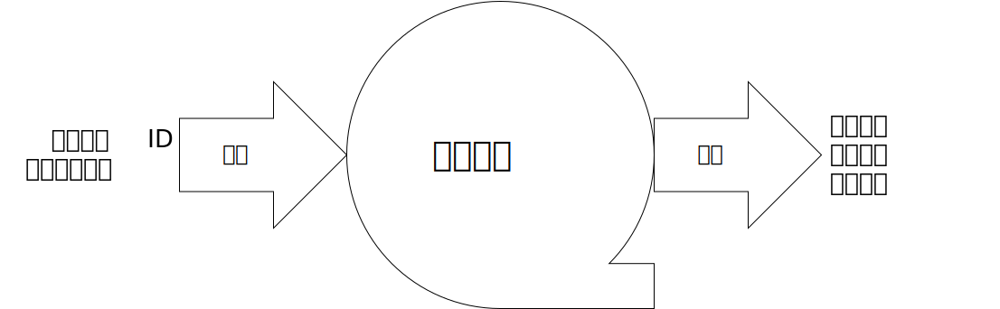
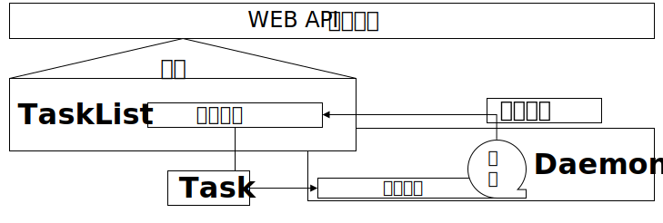

# Jmeter-REST

用RESTful API给Jmeter套上一层壳，使其能通过http请求输入JMX文件和输出测试结果

## Description

* 本项目是无锡市软测认证有限公司的测试核心业务
* 项目基于Go语言和iris，无数据库，无需连接其他应用
* 运行此应用的系统中必须有可以通过系统调用运行的`jmeter`指令及官方关机脚本`shutdown.sh`，应用将通过子进程调用`jmeter`



## Software Architecture

* 本项目由一系列API组成，主要包括：
  * 创建测试任务
  * 删除测试任务
  * 启动测试任务
  * 停止测试任务
  * 获取测试任务信息：
    * 配置文件
    * 测试日志
    * 结果文件
    * 运行状态

### 源码组织结构

本项目使用 iris 框架，按照简单的两层Web应用结构进行组织，且为重Model结构。从外到内对应的文件夹依次是`Controller`、`Model`。

* 项目的最外层是一个初始化函数`Init(...)`和用于传递设置的两个struct `Config`和`URLConfig`：
  * `Init(...)`用于解析命令行参数和设置、启动后台Deamon，并返回一个`*iris.Application`
  * `Config`封装一个`URLConfig`和一个`*util.LoggerOption`用于向`Init(...)`传递设置信息
  * `URLConfig`封装了一系列字符串数组，用于指定`Controller`中各个`Web API`在`*iris.Application`中的接口链接
* `Controller`：存放`Web API`处理函数，所有的Web请求皆直接传递到此文件夹的函数中，是对`Model`层的`Web API`封装；
* `Model`：存放基本的业务处理程序和主要业务逻辑，由`Controller`层调用并封装。

## Installation

### 创建

`Init(...)`函数会返回一个绑定了所有`Web API`的`*iris.Application`。在其设置项`Config`中，`URLConfig`用于指定指定`Controller`中各个`Web API`在`*iris.Application`中的接口链接；`LoggerOption`用于指定日志写入方法。例如下面这个`app`中：

```go
ctx := context.Background()
appCtx, _ := context.WithTimeout(ctx, 20e9)
app := Init(appCtx, Config{
  URLConfig: URLConfig{
    NewTask:    []string{"Task", "new"},
    DeleteTask: []string{"Task", "delete"},
    GetConfig:  []string{"Task", "getConfig"},
    GetResult:  []string{"Task", "getResult"},
    GetLog:     []string{"Task", "getLog"},
    StartTask:  []string{"Task", "start"},
    StopTask:   []string{"Task", "stop"},
    GetState:   []string{"Task", "getState"},
  },
  LoggerConfig: &util.LoggerConfig{
    Logger: func(s string) { fmt.Printf("PressureMeter-->%s", s) },
    Error:  func(err error) { fmt.Printf("PressureMeter-->%s", err) },
  },
})
```

各接口链接如下：

#### /Task/new/{id:path}

Post接口，在`{id:path}`上写上任务ID，Post中的`jmx`字段放上Jmx配置文件，即可新建任务。

返回值为json字符串`{"ok":bool,"message":string}`：

* 任务创建成功`ok`为`true`
* 失败`ok`为`false`，且在`message`返回错误信息

#### /Task/delete/{id:path}

Get接口，在`{id:path}`上写上任务ID，即可删除任务。

返回值为json字符串`{"ok":bool,"message":string}`：

* 任务删除成功`ok`为`true`
* 失败`ok`为`false`，且在`message`返回错误信息
* 任务不存在返回状态码404

#### /Task/start/{id:path}

Get接口，在`{id:path}`上写上任务ID，即可启动任务。这里的启动是指将任务放入Daemon中排队运行。

返回值为json字符串`{"ok":bool,"message":string}`：

* 任务启动成功`ok`为`true`
* 失败`ok`为`false`，且在`message`返回错误信息
* 任务不存在返回状态码404

#### /Task/stop/{id:path}

Get接口，在`{id:path}`上写上任务ID，即可停止任务。

返回值为json字符串`{"ok":bool,"message":string}`：

* 任务停止成功`ok`为`true`
* 失败`ok`为`false`，且在`message`返回错误信息
* 任务不存在返回状态码404

#### /Task/getState/{id:path}

Get接口，在`{id:path}`上写上任务ID，即可获取任务当前状态。状态分三种：停止、排队、运行中。

返回值为json字符串`{"message":string,"stateCode":int}`：

* 成功获取任务状态`message`返回任务状态描述，`stateCode`返回状态码
* 任务不存在返回状态码404

#### /Task/getConfig/{id:path}、/Task/getResult/{id:path}、/Task/getLog/{id:path}

Get接口，在`{id:path}`上写上任务ID，即可获取任务信息。

返回值为文件：

* 成功获取则返回对应文件：`/Task/getConfig/{id:path}`返回配置文件、`/Task/getResult/{id:path}`返回结果文件、`/Task/getLog/{id:path}`返回日志文件
* 任务不存在则返回状态码404

### 运行

```go
app.Run(iris.Addr(":8080"))
```

#### 运行例程

在项目根目录：

```go
docker build -t pressure_meter .
docker run --rm -p "80:8080" pressure_meter
```

### 退出

当初始化时向`Init(...)`传递的`context`退出时，iris app和后台Daemon会一起退出。例如在上文中初始化的`app`将会在20s后退出。

## Instructions

### 原理简述



* 系统组件分三个：
  * Task：任务调度的最小单元，记录了每个任务的信息，并且定义了每个任务的运行方式
  * TaskList：负责存储系统中的所有Task
  * Daemon：负责系统中Task的排队运行
* 所有来自Web API的操作均由TaskList组件的接口接收，其他组件的接口均不对外开放
* Task本质上是一个子进程，有启动、等待、停止三个主要功能：
  * 启动：调用系统指令`jmeter`运行操作系统中的jmeter
  * 等待：在启动功能后才能调用，等待系统指令`jmeter`执行完毕
  * 停止：调用jmeter官方的停止脚本`shutdown.sh`停止`jmeter`的执行
* TaskList本质上是一个列表，存储了系统中的所有任务信息，负责以下功能：
  * 新建任务：按照接口发来的信息新建任务，并将其放入任务列表
  * 删除任务：按照任务ID从任务列表中删除任务，并进行相关资源的释放和清理
  * 运行任务：TaskList中的运行任务是指将任务放入一个任务队列
  * 停止任务：向正在运行的任务发送停止消息
* Daemon本质上是一个任务队列和一个后台守护协程，它将按顺序依次运行任务队列中的任务，负责以下功能：
  * 运行任务：Daemon中的运行任务是指后台守护协程从任务队列中取出一个Task，然后调用这个Task的运行接口
  * 等待任务完成：当一个任务成功运行后，后台守护协程就会调用Task的阻塞等待接口，阻塞自身等待任务完成
